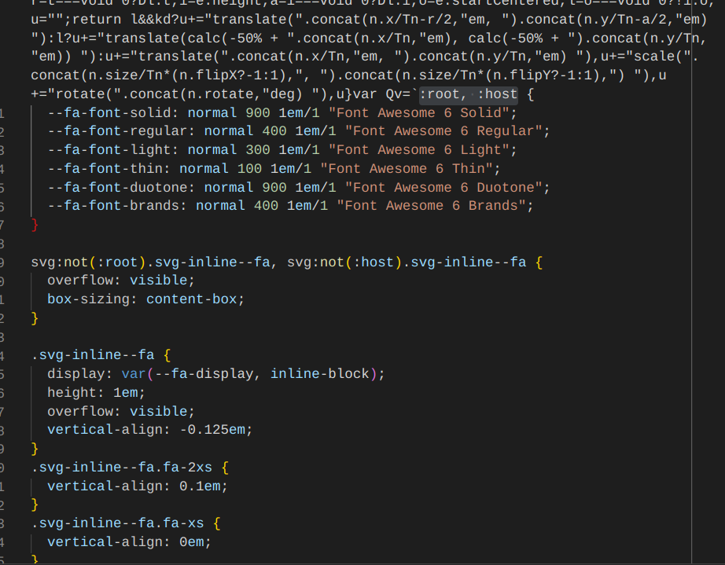

# bug in esbuild minification 

There seems to be a bug in esbuild minification in certain scenarios when replacing the "\n" character with a line break. 

## Steps to reproduce

1. Run `npm run build` 
2. Open `/build/index.js` 
3. Look for `:root, :host` inside the file and see the rest of the text is not minified

